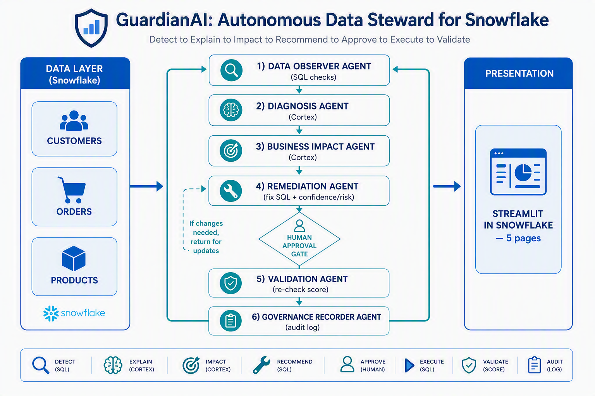

# 🛡️ GuardianAI: Autonomous Data Steward for Snowflake

> **CoCoQuest 2026 — Theme 1: Agentic Data Quality Guardian**
> An autonomous, multi-agent system that **detects, explains, remediates, and
> validates** data quality issues inside Snowflake — with a human-in-the-loop
> approval gate and a full governance audit trail.

**One-line pitch:** GuardianAI turns raw, messy tables into trusted data by
running an autonomous agent loop — and it proved it by lifting an enterprise
data trust score from **43/100 to 97/100** on a single run.

---

## 1. The Problem
Bad data silently breaks business decisions. Duplicate customers inflate reports,
orphan orders corrupt revenue attribution, invalid emails waste spend, and
negative prices distort margins. Traditional data quality tools **detect** issues
but stop there — a human still has to investigate every finding, figure out why it
happened, judge the business impact, write the fix, and prove it worked. That
doesn't scale.

## 2. The Solution
GuardianAI is an **agentic** system: a chain of specialized agents that own the
full data-quality lifecycle autonomously, pausing only for human approval on
high-risk actions.

**The loop:** `Detect → Explain → Impact → Recommend → Approve → Execute → Validate`

## 3. Why "Agentic" (not just automation)
Each agent has a distinct role, reasons over the previous agent's output, and the
system decides its own next step — including when to **stop and ask a human**. The
Remediation Agent proposes; the Validation Agent independently checks the
Remediation Agent's own work. That self-verifying loop is what makes it agentic
rather than a linear script.

## 4. Architecture


- **Data layer (Snowflake):** `CUSTOMERS`, `ORDERS`, `PRODUCTS`
- **6 agents:** Observer → Diagnosis → Impact → Remediation → Validation → Governance
- **Human approval gate** between Recommend and Execute
- **Presentation:** Streamlit in Snowflake (5 pages)

## 5. The Agents

| # | Agent | Tech | Responsibility |
|---|-------|------|----------------|
| 1 | **Data Observer** | Deterministic SQL | Detects issues, assigns severity + penalty, writes `DQ_ISSUES` |
| 2 | **Diagnosis** | Snowflake Cortex | Explains the likely root cause of each issue |
| 3 | **Business Impact** | Snowflake Cortex | Translates each issue into executive business language |
| 4 | **Remediation** | SQL + Cortex | Recommends a fix, generates the fix SQL, scores confidence + risk |
| 5 | **Validation** | Deterministic SQL | Re-runs checks, recomputes health score, proves before→after |
| 6 | **Governance Recorder** | SQL | Immutable audit trail of every action + approval |

**Design principle:** *SQL detects and executes (auditable). AI only reasons,
explains, and narrates. A human approves anything risky.*

## 6. Key Snowflake / CoCo capabilities used
- **Snowflake Cortex `COMPLETE`** (`mistral-large2`) for root-cause, business
  impact, executive summary, and remediation narration
- **Streamlit in Snowflake** for the native, zero-infrastructure dashboard
- **Stored procedures** (`RUN_APPROVED_FIXES`, `LOG_EVENT`) for safe, ordered
  execution and logging
- **SQL analytics**: `QUALIFY ROW_NUMBER()` dedup, `TRY_TO_DATE`/`TRY_TO_NUMBER`
  safe casting, `REGEXP_LIKE` validation

## 7. The Agentic Workflow (step by step)
1. **Observer** scans all 3 tables → finds 15 issues (5 critical) → overall score **43/100**.
2. **Diagnosis** generates a technical root cause for each issue.
3. **Impact** translates each into plain-English business risk.
4. **Remediation** builds a fix plan: method (AUTO_FIX / DEDUP / QUARANTINE),
   confidence %, risk level, and whether human approval is required.
5. **Approval gate** — low-risk fixes auto-approve; high-risk (delete/quarantine)
   require a human.
6. **Execution** runs only APPROVED fixes, in safe order (Customers→Orders→Products),
   quarantining bad rows instead of deleting them.
7. **Validation** re-runs the exact same checks → score climbs to **97/100**, all
   tables **LOW** risk.
8. **Governance** logs every step with actor + timestamp.

## 8. Dataset
A deliberately "dirty" retail dataset (~15 rows per table) with injected issues:
duplicate/missing IDs, invalid & missing emails, invalid phones, future order
dates, orphan orders, negative amounts/prices, missing categories, invalid flags.

## 9. Results (verified)

| Table | Before | After | Improvement |
|-------|--------|-------|-------------|
| CUSTOMERS | 30 | 90 | +60 |
| ORDERS | 36 | 100 | +64 |
| PRODUCTS | 63 | 100 | +37 |
| **OVERALL** | **43** | **97** | **+54** |

- 15 issues detected → resolved/quarantined
- 6 customers + 6 orders quarantined (not deleted) for human review
- All tables moved from CRITICAL/HIGH → LOW risk

## 10. Responsible AI
- **Human-in-the-loop approval** for every high-risk fix
- **Quarantine, never delete** — bad rows are preserved for review
- **Deterministic, auditable fix SQL** — no AI-generated code executes blindly
- **Full governance log** — every agent action is recorded with an actor
- **Separation of duties** — AI advises, SQL executes, humans approve

## 11. Business Value
- A single, trusted **data trust score** leadership can track over time
- Root cause + business impact in **plain English** for non-technical stakeholders
- Hours of manual data-steward work compressed into an autonomous, auditable loop
- The headline outcome any executive understands: **43 → 97**

## 12. Setup & Run

**Prerequisites:** a Snowflake account with Cortex enabled (verify with
`SELECT SNOWFLAKE.CORTEX.COMPLETE('mistral-large2','Say OK');`).

Run the SQL files in order:
```
sql/01_create_schema.sql          -- database, schema, warehouse
sql/02_create_tables.sql          -- 3 tables + supporting tables
sql/03_load_sample_data.sql       -- load the dirty CSVs (data/)
sql/04_quality_checks.sql         -- Observer Agent
sql/05_health_score.sql           -- initial score (43)
sql/06_create_analysis_table.sql
sql/07_diagnosis_agent.sql        -- Diagnosis Agent (Cortex)
sql/08_business_impact_agent.sql  -- Impact Agent (Cortex)
sql/09_executive_summary.sql      -- Exec summary (Cortex)
sql/11_create_remediation_table.sql
sql/12_remediation_agent.sql      -- Remediation Agent
sql/13_apply_approved_fixes.sql   -- approval gate + safe execution
sql/14_validation_agent.sql       -- Validation Agent (43 -> 97)
sql/15_governance_recorder.sql    -- Governance audit trail
```
*(Use `sql/10_fallback_no_cortex.sql` instead of 07+08 only if Cortex is
unavailable.)*

**Deploy the dashboard:** paste `app/guardianai_app.py` into a Streamlit in
Snowflake app (DB `GUARDIANAI_DB`, schema `CORE`, warehouse `GUARDIANAI_WH`).

## 13. Repository structure
```
guardianai-data-steward/
├── README.md
├── docs/
│   ├── architecture.png
│   ├── DEMO_SCRIPT.md
│   └── SUBMISSION_CHECKLIST.md
├── sql/        (files 01–15)
├── data/       (customers_bad.csv, orders_bad.csv, products_bad.csv)
└── app/        (guardianai_app.py)
```

## 14. Future roadmap
- Scheduled autonomous scans via Snowflake Tasks
- Slack/Teams alerts on new critical issues
- Learned severity weighting from historical approvals
- Data contracts + upstream prevention

---
*Built for CoCoQuest 2026 • Theme 1: Agentic Data Quality Guardian*
